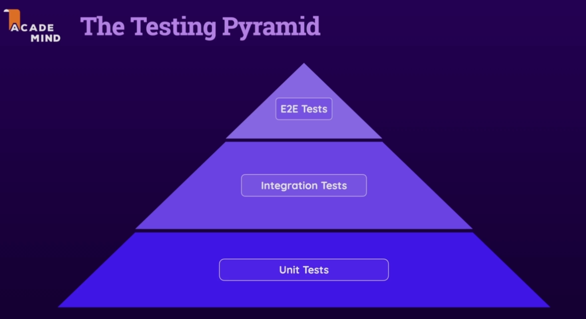
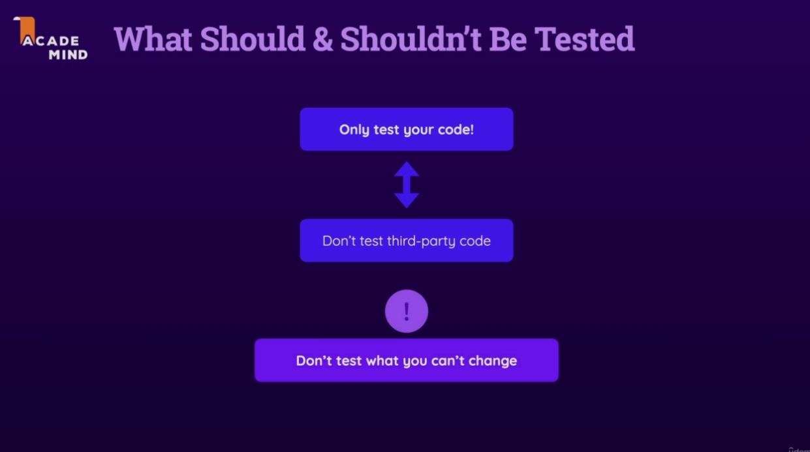

# JavaScript Unit Testing - The Practical Guide by Maximilian Schwarzmüller

# Section 1

## what is testing ?

## what are unit tests ?

## unit vs integration vs e2e tests

## TDD

# Section 2 - Setup & Testing Software

## Tools are needed for testing

**[Vitest](https://vitest.dev/)** is test runner and assertion library for JavaScript.

# Section 3 - Testing Basics

# Section 4 - Writing Good Tests

# Section 5 - Advanced Testing Concepts

## toBe() vs toEqual()

**toBe() => ===**

**toEqual() => ==**

6-5

